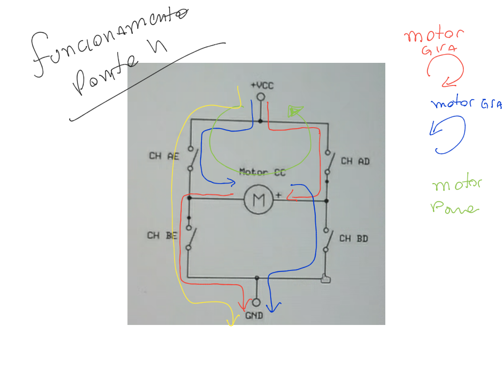
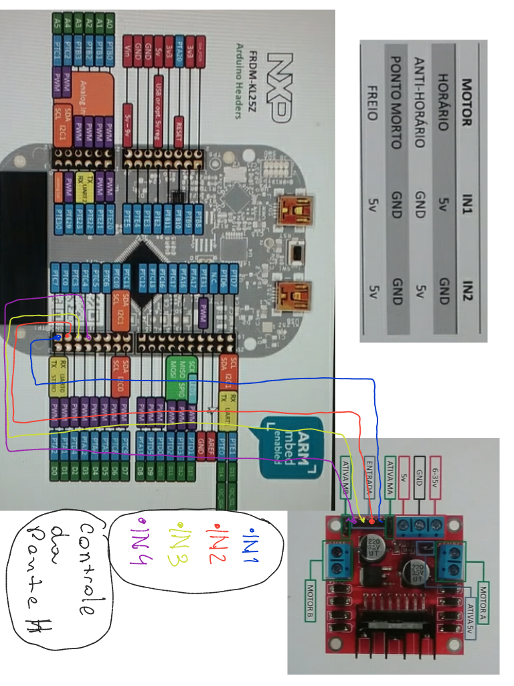

### Escola Politécnica da USP
### Aula 2 PSI 3422 Laboratório de Sistemas Eletrônicos 

# Controlar motores e medir distância

Queremos controlar os motores utilizando ponte H e lógica digital, além de medir a distância andada pelo carrinho utilizando sensor infravermelho.

## 1. Controlar Motor
## 1.1 Ponte H

A ponte H é um circuito em que fornecemos como inputs sinais responsáveis por acionar portas de transistores, responsáveis por fazerem direcionamento lógico da corrente de forma a gerar respostas desejadas no motor.

No nosso circuito, utilizaremos as portas PTC7, PTC0, PTC3 e PTC4 do controlador Freedom KL25Z para controlar os transistores da Ponte H e obtermos as respostas desejadas para o motor. As conexões das chaves da Ponte com a controladora podem ser vistas na imagem acima.

## 1.2 Firmware para controlar a Ponte H

Código teste_motor.cpp implementa funções de controle da ponte H, relacionando-as com movimentos de interesse do carrinho.

## 1.3 Integração com o Transmissor e Recepetor

Para implementar a funcionalidade carrinho de controle remoto, adaptou-se o código tx.cpp da aula 1 de forma a enviar os comandos para o carrinho utilizando os direcionais clássicos de video game. No tx.cpp, se enviarmos a tecla **w**, o carrinho vai para frente. Se enviarmos a tecla **s**, o carrinho vai para trás. A tecla **b** faz ele parar. 

No firmware do carrinho, fez-se a integração do controle dos motores com o código receptor do NRF24. Assim, o firmware do carrinho lê o comando que chegou do transmissor e aciona a lógica do motor de acordo com o comando.

>> Ver vídeo de validação do carrinho

## 2.1 Sensor Infravermelho

O sensor emite uma luz infravermelha e analisa se ela reflete e volta ou não.  Se refletir, ele retorna o valor 1 (verdadeiro, ou true).  Se não, ele retorna o valor 0 (false).  Dessa forma, pode ser usado, por exemplo, para diferenciar o preto da linha em contraste com a superfície branca ao redor. Utilzaremos então o sensor nessa situação para diferenciar branco e preto do encoder conectado a roda. 

Após algumas realizações de testes, o encoder que se apresentou com o melhor resultado foi o de 40 divises. 
Assim, podemos observar no gif abaixo o funcionamento do sensor montado no carrinho e fazendo a leitura do disco anexado na roda.

## 2.2 Contando os pulsos no firmware do carrinho

Para contar os pulsos do sensor no firmware, desenvolvi um firmware de teste denominado pulses.cpp. Nesse firmware, a roda vai girar e o terminal mostrará quantos pulsos o sensor mediu após a inicialização da placa, a partir do ajuste do potenciômetro. Útil para a calibração do sensor. 

>> Ver código de contagem de pulsos

Feita a calibração, é hora de integrar o software pulses.cpp ao firmware do carrinho.

### 2.3 Carrinho de Controle Remoto com Distância calculada

Após a integração, criou-se mais dois comandos adicionais: um comando "p" e um comando "e". O comando P é enviado pelo transmissor ao carrinho e indica que deverá começar uma contagem de pulsos. O comando E diz para o carrinho encerrar a contagem e enviar o numero de pulsos para o transmissor.

>> Mostrar nos códigos tx.cpp e controle_remoto.cpp a funcionalidade

Feita a aquisição dos pulsos, queremos convertê-la em distância. Para isso, tiramos a relação pulso-distância fazendo o carrinho andar uma distãncia de 1 metro e dai contamos o número de pulsos. 

>> Mostrar video de validação da aquisição

Após calcularmos a relação distância-pulsos, determinou-se a fórmula: $$ d = n_{pulsos}/76$$

Como podemos ver no código.

Para validar o cálculo de distãncia, aumentamos a distância para 1.4 metros. Vamos ver como o carrinho se comportou e qual distância ele mediu..

>> Mostrar video de validação calculo de distancia

Ainda há um erro que dá para ser corrigido em eventuais calibrações ou até mesmo fechamento da malha de controle para diminuirmos o erro de medida.

Obrigado pela atenção! Valeu!
