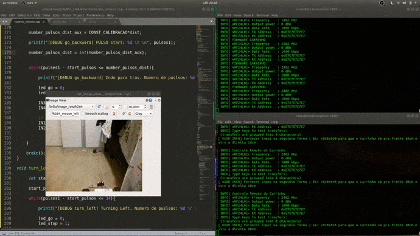

# Aula 5 - Carrinho Controlado por Coordenadas

O objetivo é fornecer uma coordenada para o carrinho (ex: {+137,+100}) e o mesmo executar o comando, chegando o mais próximo possível da coordenada.
Para a conclusão desse objetivo, fez-se uso dos sensores ultrassônico e infravermelho. 
A fusão dos sensores foi feita da seguinte maneira: o loop da função "vai pra frente" é quebrado em duas hipóteses: 
- Se a leitura de distancia percorrida do ultrassom for maior que a distância fornecida;
- Se a leitura do distancia percorrida do encoder for maior que a distancia fornecida;

Dessa forma, se um dos sensores, devidamente calibrados, apontarem a distância alcançada, então o carrinho para.
Além disso, independentemente do encoder, se o carrinho encontrar um obstáculo, ele evita a colisão, freiando adequadamente.

A metodologia de validação do projeto foi a seguinte: sorteou-se uma coordenada (no caso o sorteio forneceu [137,100]) e mandou-se o carrinho para a posição fornecida.
A interface de controle pode ser vista no exemplo abaixo, em que o carrinho foi para a coordenada {+50,-30}:

-> Mostrar sorteio
-> Mostrar carrinho andando
-> Mostrar código

